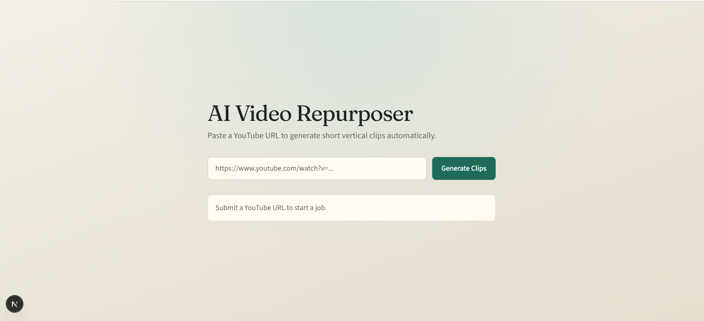

# AI Video Repurposer

Turn long-form YouTube videos into short-form vertical clips (TikTok / YouTube Shorts / Instagram Reels).

The local pipeline:

1. Downloads the video with **yt-dlp** (best quality ≤1080p)
2. Transcribes speech with **OpenAI Whisper**
3. Asks an LLM to pick engaging clip windows
4. Extends too-short clips using whole transcript segments (deterministic)
5. Validates clips (15–60s, bounds, overlap, top-N)
6. Cuts each clip with **FFmpeg**: trim → center-crop **9:16** → burn-in captions → MP4

## 📸 Screenshots

### Home Page


**Primary entry point:** `backend/services/engine.py` (`python -m services.engine` from `backend/`)

## Architecture

Frontend
- Next.js 15

Backend
- FastAPI

Processing Pipeline
- yt-dlp
- Whisper
- AI Curation
- FFmpeg

Deployment
- Railway (backend Root Directory = `backend/`, builder = **Railpack**)
  - Service variable: `RAILPACK_DEPLOY_APT_PACKAGES=ffmpeg`
  - Optional: `RAILPACK_PACKAGES=node` (yt-dlp EJS / YouTube challenges)
- Vercel (planned)

---

## Prerequisites

| Requirement | Notes |
|-------------|--------|
| **Python 3.11+** | Tested with 3.13 |
| **FFmpeg on PATH** | Must include `libx264`, `libmp3lame`, and `subtitles` / libass |
| **OpenAI API key** | Required for Whisper + default curation (`gpt-4o-mini`) |
| **Anthropic API key** | Optional — if set, curation uses Claude 3.5 Sonnet instead |

### Check FFmpeg

```powershell
ffmpeg -version
```

You should see a normal version banner. Caption burn-in needs the `subtitles` filter (libass). On Windows, [gyan.dev](https://www.gyan.dev/ffmpeg/builds/) “full” builds usually include it; some “essentials” builds may not.

---

## Installation

```powershell
cd C:\Users\Acer\Desktop\ai-video-repurposer

# Create virtual environment
python -m venv venv

# Activate (PowerShell)
.\venv\Scripts\Activate.ps1

# Install Python dependencies
pip install -r requirements.txt
```

If `python` is not on PATH, try `py -3 -m venv venv`, then always use:

```powershell
.\venv\Scripts\python.exe ...
```

### macOS / Linux

```bash
cd /path/to/ai-video-repurposer
python3 -m venv venv
source venv/bin/activate
pip install -r requirements.txt
```

---

## Environment variables

Create a `.env` file in the **project root** (never commit it):

```env
OPENAI_API_KEY=sk-...

# Optional — prefer Claude for clip curation when set:
# ANTHROPIC_API_KEY=sk-ant-...
```

| Variable | Required | Used by |
|----------|----------|---------|
| `OPENAI_API_KEY` | Yes (Whisper + default curation) | `transcriber.py`, `curator.py` |
| `ANTHROPIC_API_KEY` | No | `curator.py` (Claude 3.5 Sonnet if present) |

Loaded via `python-dotenv` from `backend/.env`, with a fallback to the monorepo root `.env` for local development.

---

## How to run

### End-to-end (recommended)

Run from the `backend/` directory so the `services` package imports cleanly (same layout Railway deploys):

```powershell
.\venv\Scripts\Activate.ps1
cd backend
..\venv\Scripts\python.exe -m services.engine "https://www.youtube.com/watch?v=VIDEO_ID"
```

If you omit the URL, the script prompts for one.

This run:

1. Downloads (or reuses) the video under `backend/downloads/`
2. Transcribes → `backend/transcripts/sanitized_<id>.json`
3. Curates (+ extends short windows) → `backend/transcripts/curated_<id>.json`
4. Cuts captioned 9:16 MP4s → `backend/output_clips/`

The engine passes **exact** paths from the same run into the cutter (no “pick latest file” guessing).

### Run stages individually

```powershell
cd backend

# Download + transcribe + sanitize
..\venv\Scripts\python.exe -m services.pipeline "https://youtu.be/VIDEO_ID"

# Curate only
..\venv\Scripts\python.exe -m services.curator "transcripts\sanitized_VIDEO_ID.json"

# Cut only — BOTH paths required
..\venv\Scripts\python.exe -m services.video_cutter `
  "downloads\Some Title [VIDEO_ID].mp4" `
  "transcripts\curated_VIDEO_ID.json"
```

### Expected outputs

- `backend/downloads/… [VIDEO_ID].mp4`
- `backend/transcripts/sanitized_VIDEO_ID.json`
- `backend/transcripts/curated_VIDEO_ID.json`
- `backend/output_clips/clip_1_….mp4`, `clip_2_….mp4`, …

---

## Folder structure

```
ai-video-repurposer/
├── .cursorrules          # Project rules / intended SaaS stack
├── .env                  # Secrets (gitignored; also supported at backend/.env)
├── .gitignore
├── requirements.txt
├── README.md
├── project_spec.md       # Detailed technical specification
├── venv/                 # Local virtualenv (gitignored)
├── frontend/             # Next.js app
└── backend/              # FastAPI + pipeline (Railway Root Directory)
    ├── requirements.txt
    ├── app/              # HTTP API
    ├── services/         # Offline pipeline (engine, whisper, ffmpeg, …)
    ├── downloads/        # yt-dlp source videos (gitignored)
    ├── transcripts/      # sanitized_*.json + curated_*.json (gitignored)
    └── output_clips/     # Final short MP4s (gitignored)
```

Temporary files (cleaned up after use): `backend/temp_audio.mp3`, `backend/temp.srt`.

---

## Troubleshooting

### `No clips remained after validation`

Historically caused by the LLM returning single Whisper segments (~3–8s) below the 15s minimum. The curator now **extends** short clips forward (then backward if needed) using whole transcript segment boundaries before validation. If you still see this:

- Confirm the source video is longer than ~15 seconds
- Check debug lines `DEBUG[curator/extend]` / `DEBUG[curator/stats]` in the console
- Re-run curation alone on an existing sanitized JSON

### FFmpeg / subtitles errors

- Verify `ffmpeg` is on PATH: `ffmpeg -version`
- Caption burn-in needs the `subtitles` filter (libass). Switch to a full FFmpeg build if missing
- On Windows, SRT burn-in uses a relative `temp.srt` with `cwd` at `backend/`

### Whisper / file size errors

Audio is compressed to mono 16 kHz / 64 kbps MP3 before upload. Very long videos can still exceed Whisper’s ~25 MB limit — chunking is not implemented yet.

### API / rate limits

- Ensure `.env` is in `backend/` or the monorepo root and `OPENAI_API_KEY` is set
- Long transcripts can hit OpenAI TPM limits; curation compresses the transcript first
- Optional: set `ANTHROPIC_API_KEY` to use Claude for curation

### yt-dlp / YouTube warnings

You may see a warning about no JavaScript runtime. Install a supported runtime if formats fail to extract — see the [yt-dlp EJS wiki](https://github.com/yt-dlp/yt-dlp/wiki/EJS).

### Unicode / console errors on Windows

Rare `UnicodeEncodeError` when printing characters like `→` under cp1252. Processing may still have succeeded — check `backend/output_clips/` and whether logs already printed `status: success`.

### `python` not found

Use the venv interpreter explicitly from `backend/`:

```powershell
cd backend
..\venv\Scripts\python.exe -m services.engine "https://www.youtube.com/watch?v=VIDEO_ID"
```

---

## More detail

See [`project_spec.md`](project_spec.md) for module responsibilities, JSON contracts, data-flow diagrams, known limitations, and the SaaS roadmap.


## Status

✅ Video download

✅ Transcript generation

✅ AI clip curation

✅ Clip validation

✅ MP4 export

✅ FastAPI Backend

✅ Next.js Frontend

🚧 Railway Deployment

🚧 Vercel Deployment

🚧 Authentication

🚧 Database

🚧 Supabase integration
