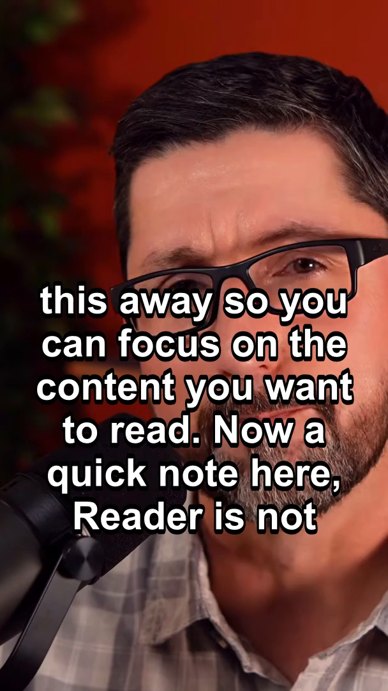
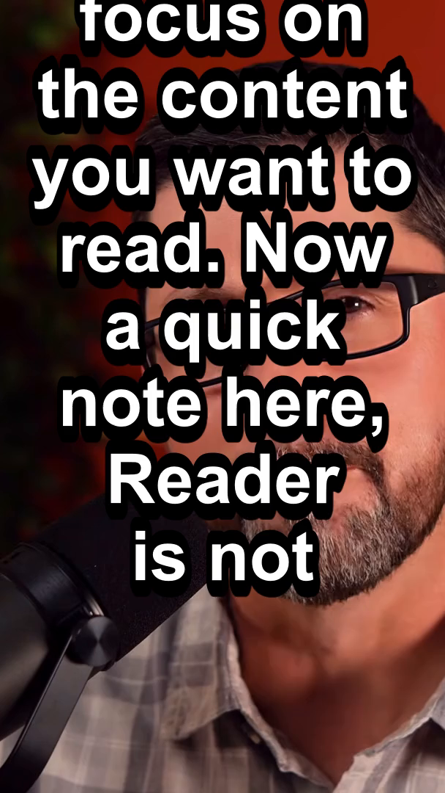
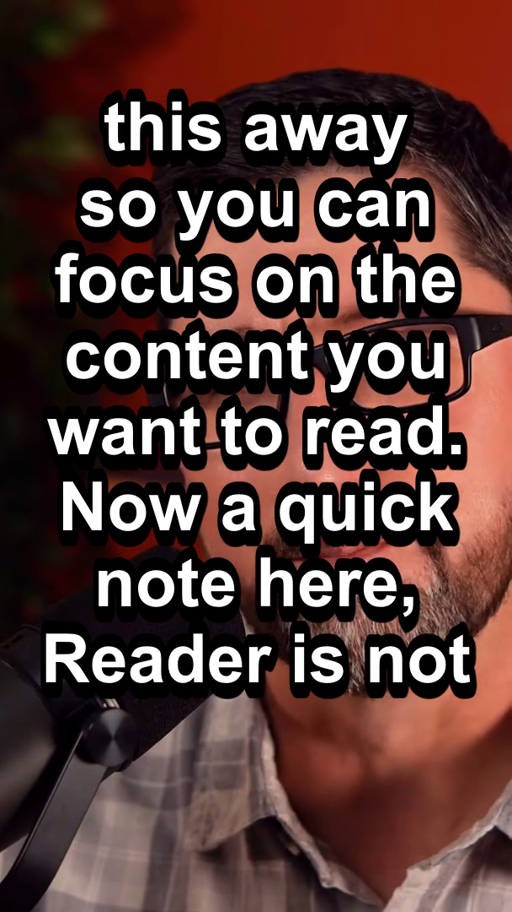
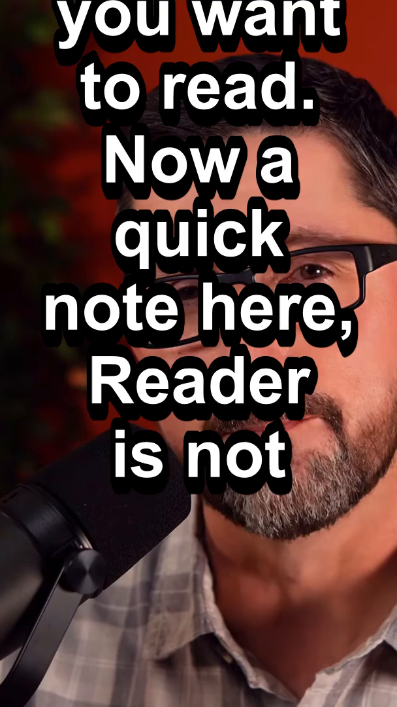
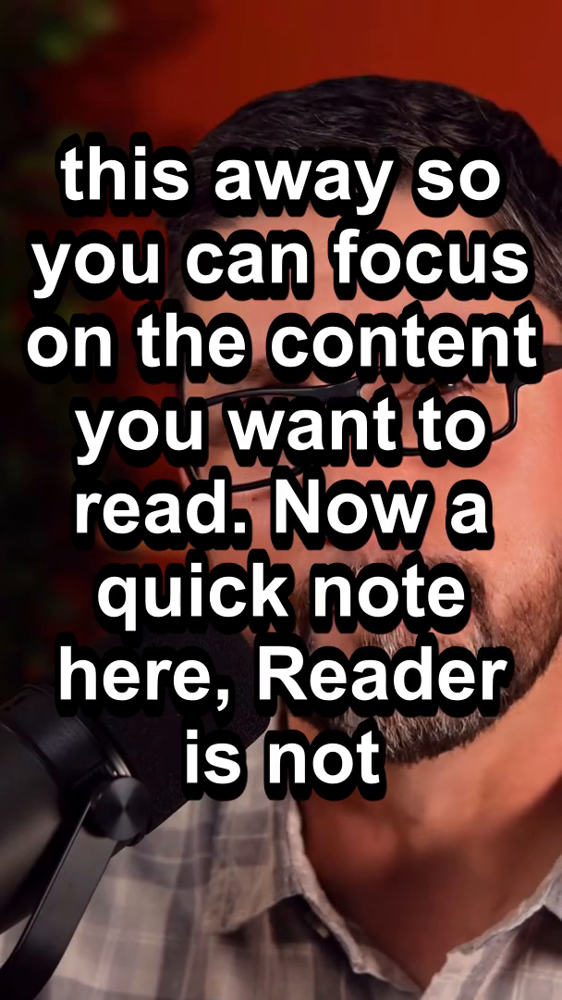

# Subtitle Preset Comparison — Founder Review

**Product:** T-Clipper  
**Purpose:** Visual bake-off of five subtitle styles.  
**Decision owner:** Founder (no winner selected in this document).

---

## Method

| Constant | Value |
|----------|--------|
| Source video | `Your Mac Browser Is Missing This [hXET-58xrqM].mp4` |
| Curated clip | clip_id **1** — “The Reader Feature” |
| Cut window | `488.520s → 546.920s` (identical editorial padding) |
| Transcript / SRT | Same sanitized transcript; **one** SRT generated and reused |
| Crop | Identical `crop=ih*9/16:ih` |
| Frame sample | `t = 25.0s` into each export |
| Only variable | `force_style` subtitle knobs |

Shared (unchanged across presets):

- `Bold=1`
- `PrimaryColour=&H00FFFFFF` (white)
- `OutlineColour=&H00000000` (black)
- `BorderStyle=1`

Renderer: existing `backend/services/video_cutter.py` `cut_clip()` path (style monkeypatched per run only; production default file unchanged).

Regenerate: `python comparison/generate_presets.py` (from repo, with `PYTHONPATH=backend`).

---

## Files

| Preset | Video | Frame |
|--------|-------|-------|
| A Minimal | [preset_a.mp4](./preset_a.mp4) | [preset_a.png](./preset_a.png) |
| B TikTok | [preset_b.mp4](./preset_b.mp4) | [preset_b.png](./preset_b.png) |
| C Balanced (Opus-inspired) | [preset_c.mp4](./preset_c.mp4) | [preset_c.png](./preset_c.png) |
| D Accessibility | [preset_d.mp4](./preset_d.mp4) | [preset_d.png](./preset_d.png) |
| E T-Clipper Default (experimental) | [preset_e.mp4](./preset_e.mp4) | [preset_e.png](./preset_e.png) |

---

## Parameter table

| Knob | A Minimal | B TikTok | C Balanced | D Accessibility | E T-Clipper Default |
|------|----------:|---------:|-----------:|----------------:|--------------------:|
| FontSize | 18 | 28 | 24 | 30 | 24 |
| Outline | 2 | 5 | 4 | 5 | 4 |
| Shadow | 0 | 1 | 1 | 2 | 1 |
| MarginV | 64 | 72 | 68 | 88 | 58 |
| MarginL | 28 | 22 | 20 | 32 | 18 |
| MarginR | 28 | 22 | 20 | 32 | 18 |
| Alignment | 2 | 2 | 2 | 2 | 2 |

`Alignment=2` = bottom-center (ASS numpad). With multi-line wraps, the block grows **upward** from the bottom margin.

---

## Side-by-side frames (t = 25s)

### Preset A — Minimal

| | |
|--|--|
| **Values** | FontSize=18, Outline=2, Shadow=0, MarginV=64, MarginL/R=28, Alignment=2 |
| **Strengths** | Quietest stroke; widest side margins among “non-access” presets; least “sticker” energy; more room for the picture when cues are short |
| **Weaknesses** | Thinner outline weaker on busy frames; smaller type easier to miss muted in-feed; dense Whisper cues still stack |

### Preset B — TikTok

| | |
|--|--|
| **Values** | FontSize=28, Outline=5, Shadow=1, MarginV=72, MarginL/R=22, Alignment=2 |
| **Strengths** | Strong in-feed punch; thick stroke survives busy backgrounds; raised MarginV clears more bottom chrome than E |
| **Weaknesses** | Larger type → more line wraps → taller stacks over faces; can feel meme-loud on podcast/education |

### Preset C — Balanced (Opus-inspired)

| | |
|--|--|
| **Values** | FontSize=24, Outline=4, Shadow=1, MarginV=68, MarginL/R=20, Alignment=2 |
| **Strengths** | Mid-pack size and stroke; slightly higher than E for chrome; slightly wider sides than E for wrap; neutral “AI clipper” product look |
| **Weaknesses** | Less aggressive than B for pure viral feeds; not as large as D for max legibility |

### Preset D — Accessibility

| | |
|--|--|
| **Values** | FontSize=30, Outline=5, Shadow=2, MarginV=88, MarginL/R=32, Alignment=2 |
| **Strengths** | Largest type; strongest outline+shadow; highest bottom clearance; widest side margins |
| **Weaknesses** | Most face/body occlusion on close-ups; densest vertical stacks; heaviest visual weight |

### Preset E — T-Clipper Default (experimental)

| | |
|--|--|
| **Values** | FontSize=24, Outline=4, Shadow=1, MarginV=58, MarginL/R=18, Alignment=2 |
| **Strengths** | Exact current production shipping style; known baseline for regression comparison |
| **Weaknesses** | Lowest MarginV of the five (closest to bottom chrome); tightest side margins of the five |

---

## How to review (recommended)

1. Open the five MP4s side-by-side or in sequence (not only the PNGs).  
2. Scrub muted — captions must carry the hook alone.  
3. Check: bottom UI chrome clearance, face occlusion, wrap height on dense speech, outdoor/busy readability.  
4. Compare especially **C vs E** (same FontSize/Outline/Shadow; only margins differ) and **B vs D** (both large/loud).

---

## Reviewer notes (neutral)

- At this sample timestamp, several SRT cues are active; larger `FontSize` increases wrap count, so bottom-aligned stacks climb higher over the speaker. That is expected with `Alignment=2`, not a crop difference.  
- Colours were held constant (white fill, black outline) across all presets.  
- Production `backend/services/video_cutter.py` default was **not** permanently changed by this bake-off.

---

## Decision

**No default is recommended in this document.**  
Please mark the chosen MVP preset (A / B / C / D / E) after review; engineering will apply only that style when instructed.
