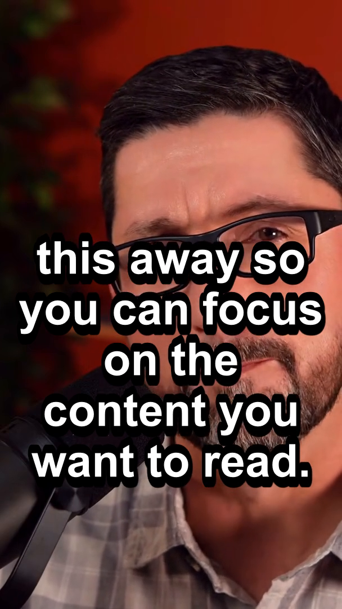
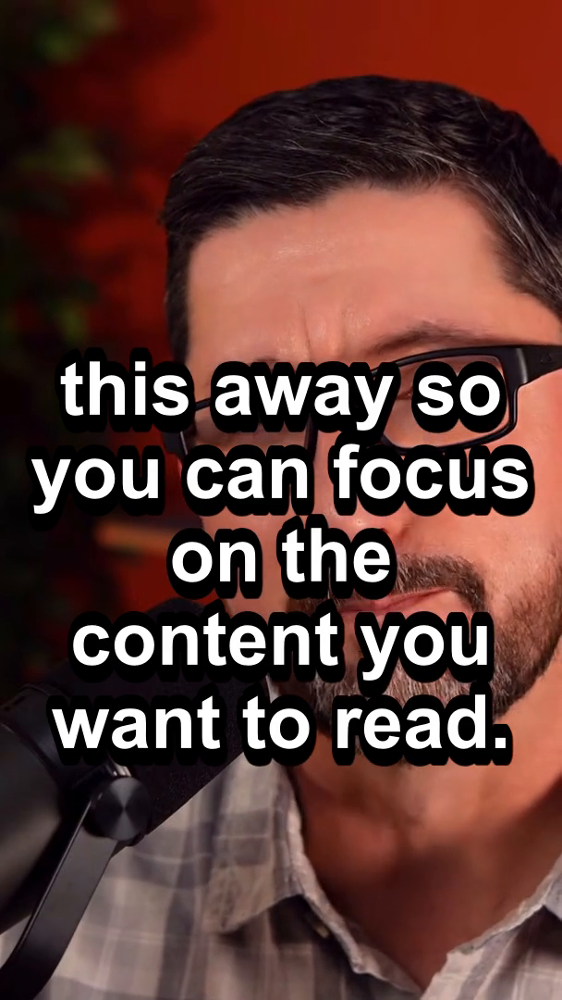
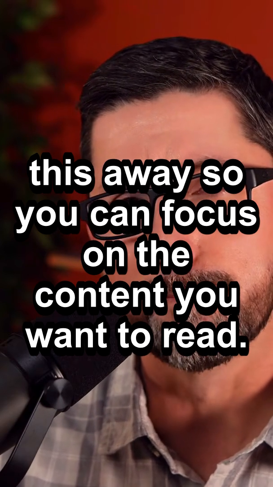
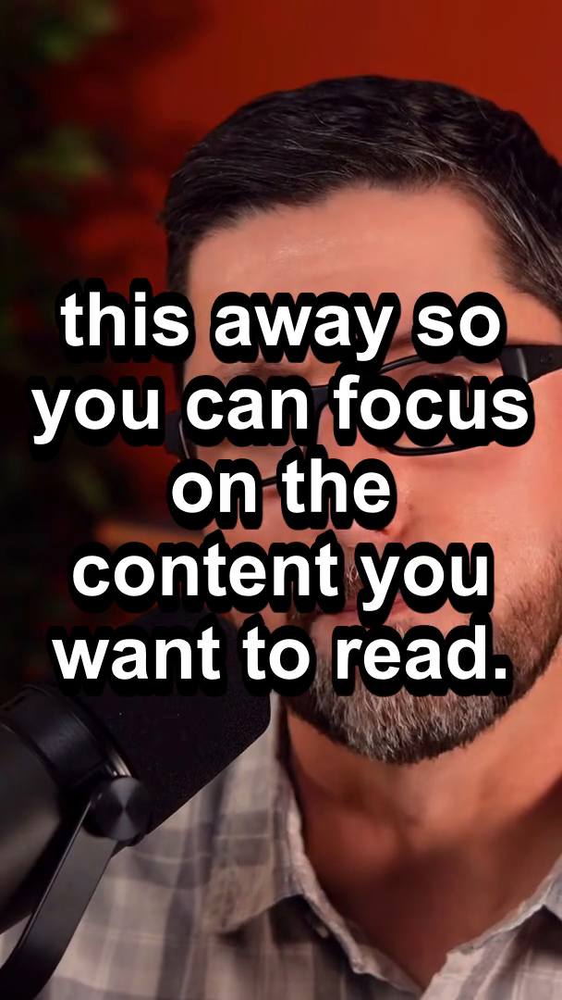

# Subtitle Position Experiment — MarginV

> **T-Clipper** — Positioning bake-off only.  
> **Date:** 2026-07-30  
> **Decision owner:** Founder (no winner selected here).

---

## Method

| Constant | Value |
|----------|--------|
| Source | `Your Mac Browser Is Missing This [hXET-58xrqM].mp4` |
| Clip | curated clip_id **1** (“The Reader Feature”) |
| Cut window | `488.520s → 546.920s` |
| SRT | **One** generated SRT reused for all four renders (layout engine on) |
| Crop | Identical `crop=ih*9/16:ih` |
| FontSize / Outline / Shadow / colours / MarginL/R / Alignment | **Identical** (production baseline except MarginV) |
| Frame sample | `t = 25.0s` |
| Only variable | **MarginV** |

Baseline style (unchanged knobs):

```text
FontSize=24, Bold=1, PrimaryColour=&H00FFFFFF, OutlineColour=&H00000000,
BorderStyle=1, Outline=4, Shadow=1, Alignment=2, MarginL=18, MarginR=18,
MarginV=<58|68|78|88>
```

Production `video_cutter.py` default remains `MarginV=58` (experiment used in-process monkeypatch only).

Reproduce:

```powershell
$env:PYTHONPATH = "backend"
.\venv\Scripts\python.exe comparison\generate_margin_experiment.py
```

---

## Files

| MarginV | Video | Frame |
|--------:|-------|-------|
| 58 | [margin58.mp4](../comparison/margin58.mp4) | [margin58.png](../comparison/margin58.png) |
| 68 | [margin68.mp4](../comparison/margin68.mp4) | [margin68.png](../comparison/margin68.png) |
| 78 | [margin78.mp4](../comparison/margin78.mp4) | [margin78.png](../comparison/margin78.png) |
| 88 | [margin88.mp4](../comparison/margin88.mp4) | [margin88.png](../comparison/margin88.png) |

---

## Screenshot comparison (t = 25s)

### MarginV = 58 (current baseline)



### MarginV = 68



### MarginV = 78



### MarginV = 88



**Visual trend:** With `Alignment=2` (bottom-center), **higher MarginV lifts the entire caption block upward**. The bottom gap grows; the top of the stack moves further into the face.

---

## Per-version notes

### MarginV = 58 — baseline

| Dimension | Observation |
|-----------|-------------|
| **Face visibility** | Best of the four — stack sits lower; more mouth/chin often clearer than at 88 |
| **Subtitle readability** | High (same type style); block still readable |
| **Est. Shorts/TikTok UI clearance** | Lowest — captions closest to bottom chrome (like/comment/caption bar) |
| **Pros** | Least face occlusion; matches today’s production default |
| **Cons** | Highest risk of platform UI covering the bottom line(s) |

### MarginV = 68

| Dimension | Observation |
|-----------|-------------|
| **Face visibility** | Slightly more coverage of lower face vs 58 |
| **Subtitle readability** | Same glyph style; position mid-low |
| **Est. Shorts/TikTok UI clearance** | Modest improvement over 58 |
| **Pros** | Small safe-area bump without a large jump |
| **Cons** | Still may graze dense bottom UI on some devices; more face than 58 |

### MarginV = 78

| Dimension | Observation |
|-----------|-------------|
| **Face visibility** | Noticeably more occlusion of mouth / mid-face |
| **Subtitle readability** | Still high contrast |
| **Est. Shorts/TikTok UI clearance** | Comfortable gap above typical bottom chrome |
| **Pros** | Stronger platform chrome clearance |
| **Cons** | Talking-head expression harder to read; stack sits higher |

### MarginV = 88

| Dimension | Observation |
|-----------|-------------|
| **Face visibility** | Worst of the four — block rides highest into eyes/nose region |
| **Subtitle readability** | Still high |
| **Est. Shorts/TikTok UI clearance** | Best — largest empty band at bottom |
| **Pros** | Maximum clearance from Shorts/TikTok/Reels bottom UI |
| **Cons** | Maximum face obstruction on close-ups |

---

## Cross-cutting observations

1. **Only MarginV changed** — text content and style knobs match across all four.  
2. **Layout engine is active** — SRT has more/shorter cues than the pre-layout bake-off; residual **libass soft-wrap** can still add visual lines inside a cue at FontSize=24 (orthogonal to this MarginV test).  
3. **Trade-off is linear:** UI clearance ↑ ↔ face visibility ↓ as MarginV increases.  
4. Review by scrubbing the four MP4s muted on a phone-sized viewport, not only the PNGs.

---

## Decision

**No default MarginV is recommended in this document.**  
Please choose `58` / `68` / `78` / `88` (or another value) after review; engineering will apply only that change when instructed.
