# AI Video Repurposer — Project Specification

> **Status:** Local Python video-processing engine is implemented and verified end-to-end (download → Whisper → LLM curation → deterministic clip extension → validation → FFmpeg cut). FastAPI, Next.js, and Supabase SaaS layers from `.cursorrules` are **not built yet**.

---

## 1. Project overview and purpose

**AI Video Repurposer** turns long-form YouTube videos into short-form, vertical clips suitable for TikTok / YouTube Shorts / Instagram Reels.

The pipeline:

1. Downloads a YouTube video (best quality ≤1080p).
2. Transcribes speech with OpenAI Whisper (`verbose_json` + segment timestamps).
3. Sanitizes transcript segments into a lean JSON schema.
4. Uses an LLM (GPT-4o-mini or Claude 3.5 Sonnet) to pick the most engaging clip windows.
5. **Deterministically extends** any clip shorter than 15s using whole transcript segments (forward first, then backward) — no LLM involvement.
6. Deterministically validates clips (duration, bounds, overlap, top-N).
7. Cuts each clip with FFmpeg: trim → center-crop to **9:16** → burn-in captions → export MP4.

**Primary entry point:** `services/engine.py` → `process_video_to_clips(video_url)`.

**Long-term product vision** (from `.cursorrules`): a SaaS with FastAPI backend, Next.js frontend, and Supabase auth/DB. Current work focuses only on the offline processing engine.

---

## 2. Folder and file structure

```
ai-video-repurposer/
├── .cursorrules              # Project rules / intended tech stack
├── .env                      # Secrets (OPENAI_API_KEY, optional ANTHROPIC_API_KEY)
├── .gitignore
├── requirements.txt
├── README.md
├── project_spec.md           # This document
├── venv/                     # Python virtual environment
├── downloads/                # Source videos from yt-dlp
├── transcripts/              # sanitized_*.json and curated_*.json
├── output_clips/             # Final short-form MP4s
└── services/                 # Processing modules (decoupled from any web server)
    ├── video_downloader.py
    ├── transcriber.py
    ├── pipeline.py
    ├── curator.py
    ├── clip_validator.py
    ├── video_cutter.py
    └── engine.py
```

### Artifact folders

| Folder | Role |
|--------|------|
| `downloads/` | Raw source videos saved by yt-dlp as `Title [video_id].mp4`. Input to transcription and cutting. |
| `transcripts/` | Intermediate AI artifacts: `sanitized_<video_id>.json` (clean segments) and `curated_<video_id>.json` (chosen clips). |
| `output_clips/` | Final deliverables: `clip_<id>_<sanitized_title>.mp4` (9:16, captioned). |

Temporary files (cleaned up after use):

- `temp_audio.mp3` — compressed audio for Whisper (deleted in `finally`).
- `temp.srt` — per-clip subtitle file for FFmpeg burn-in (deleted in `finally`).

---

## 3. Main workflow of the application

```
YouTube URL
    │
    ▼
[1] video_downloader.download_video()
    → downloads/Title [id].mp4
    │
    ▼
[2] transcriber.transcribe_video()
    → extract_compressed_audio() → Whisper API → segments
    │
    ▼
[3] pipeline.sanitize + save
    → transcripts/sanitized_<id>.json
    │
    ▼
[4] curator.curate_clips()
    → compress_transcript() → LLM → boundary snap
    → extend short clips (whole segments, forward then backward)
    → clip_validator.validate_and_filter_clips()
    → transcripts/curated_<id>.json
    │
    ▼
[5] video_cutter.process_all_curated_clips(video_path, curated_json_path)
    → generate_srt_for_clip() + cut_clip() per clip
    → output_clips/clip_*.mp4
```

Orchestration is done by:

- **`pipeline.run_ingestion_pipeline(url)`** — steps 1–3 (download + transcribe + sanitize).
- **`engine.process_video_to_clips(url)`** — steps 1–5 end-to-end, passing **exact** `video_path` and `curated_json_path` into the cutter (no “pick latest file” auto-detect).

---

## 4. Responsibilities of each module and service

### `video_downloader.py`

- **Purpose:** Fetch media from a URL with yt-dlp.
- **Key API:** `download_video(url) -> str` (local absolute path).
- **Behavior:** Best video+audio ≤1080p (`bv*[height<=1080]+ba/b[height<=1080]`), merge to MP4, create `downloads/` if needed.
- **Standalone test:** `python services/video_downloader.py`

### `transcriber.py`

- **Purpose:** Speech-to-text via OpenAI Whisper.
- **Key APIs:**
  - `extract_compressed_audio(video_path, output_audio_path="temp_audio.mp3")` — FFmpeg mono 16 kHz / 64 kbps MP3 to stay under Whisper’s 25 MB limit.
  - `transcribe_video(video_path, save_json=True) -> dict`
- **Behavior:** Sends compressed audio (not the full video); returns language, duration, full text, and segments (`id`, `start`, `end`, `text`). Rejects audio still over 24 MB. Deletes temp MP3 in `finally`.
- **Standalone test:** `python services/transcriber.py`

### `pipeline.py`

- **Purpose:** Ingestion glue — download + transcribe + sanitize in one call.
- **Key API:** `run_ingestion_pipeline(video_url) -> {"video_path", "sanitized_transcript_path"}`
- **Sanitize:** Keeps only `id`, `start`, `end`, `text` per segment; writes `transcripts/sanitized_<video_id>.json`.
- **Standalone test:** `python services/pipeline.py <youtube_url>`

### `curator.py`

- **Purpose:** LLM-based clip selection + deterministic duration rescue.
- **Schemas (Pydantic):**
  - `Clip`: `clip_id`, `title`, `hook`, `start_time`, `end_time`, `virality_score` (1–100), `duration`
  - `CurationResponse`: `clips`, `overall_summary`
- **Key APIs:**
  - `compress_transcript(sanitized_json_path) -> str` — compact lines `[start - end] text` to reduce TPM usage.
  - `curate_clips(sanitized_transcript_path) -> dict`
- **LLM:** Prefer Anthropic Claude 3.5 Sonnet if `ANTHROPIC_API_KEY` is set; else OpenAI `gpt-4o-mini` with `max_tokens=4096` and structured parse into `CurationResponse`.
- **Post-LLM (deterministic, no LLM):**
  1. Snap timestamps to nearest transcript boundaries.
  2. If duration `< 15s`, **extend** using whole segments only:
     - Prefer extending **forward** to later segment ends (never mid-segment).
     - If forward would exceed 60s or hits EOF without reaching 15s, extend **backward** to earlier segment starts.
     - Preserve `clip_id`, `title`, `hook`, `virality_score`.
  3. Call `validate_and_filter_clips`.
- **Output:** `transcripts/curated_<video_id>.json`
- **Standalone test:** `python services/curator.py [sanitized_json_path]`

### `clip_validator.py`

- **Purpose:** Deterministic cleanup of LLM/extended clip candidates (no network).
- **Key API:** `validate_and_filter_clips(clips, max_clips=10) -> list[Clip]`
- **Rules:**
  1. `start_time >= 0` and `start_time < end_time`
  2. Duration must be **15–60 seconds** (else discard)
  3. If two clips share **>50%** of the shorter span, keep higher `virality_score`
  4. Sort by score descending; keep top `max_clips`; renumber `clip_id`

### `video_cutter.py`

- **Purpose:** Render final Shorts/TikTok files with FFmpeg (subprocess).
- **Key APIs:**
  - `generate_srt_for_clip(clip, sanitized_json_path, output_srt_path)` — SRT cues **relative to clip start**.
  - `cut_clip(input_video_path, start_time, end_time, output_clip_path, relative_srt_path=None)` — fast seek (`-ss` before `-i`), re-encode `libx264`/`aac`, filter `crop=ih*9/16:ih,subtitles=temp.srt`.
  - `process_all_curated_clips(video_path, curated_json_path) -> list[str]` — **strictly uses the two arguments**; does not auto-pick other downloads/curated files.
- **CLI:** Requires both paths:  
  `python services/video_cutter.py <video_path> <curated_json_path>`

### `engine.py`

- **Purpose:** Single product entry point for the full pipeline.
- **Key API:** `process_video_to_clips(video_url) -> dict`
- **Steps logged:** `[1/4]` download, `[2/4]` transcribe, `[3/4]` curate, `[4/4]` cut.
- **Success payload:**
  ```json
  {
    "status": "success",
    "video_path": "...",
    "curated_json_path": "...",
    "clips": [ ... ],
    "output_clip_paths": [ ... ]
  }
  ```
- **Failure payload:** `{"status": "error", "message": "..."}` (exceptions caught; no raise to caller).
- **Standalone test:** `python services/engine.py <youtube_url>`

---

## 5. Data flow between components

```mermaid
flowchart LR
  URL[YouTube URL] --> ENG[engine.process_video_to_clips]
  ENG --> PIPE[pipeline.run_ingestion_pipeline]
  PIPE --> DL[video_downloader.download_video]
  DL --> VID[(downloads/*.mp4)]
  PIPE --> TR[transcriber.transcribe_video]
  VID --> TR
  TR --> SAN[(transcripts/sanitized_id.json)]
  ENG --> CUR[curator.curate_clips]
  SAN --> CUR
  CUR --> COMP[compress_transcript]
  COMP --> LLM[GPT-4o-mini / Claude]
  LLM --> EXT[extend short clips via segment bounds]
  EXT --> VAL[clip_validator.validate_and_filter_clips]
  VAL --> CURJ[(transcripts/curated_id.json)]
  ENG --> CUT[video_cutter.process_all_curated_clips]
  VID --> CUT
  CURJ --> CUT
  SAN --> CUT
  CUT --> OUT[(output_clips/*.mp4)]
```



### JSON contracts (simplified)

**`sanitized_<id>.json`**

```json
{
  "video_id": "...",
  "video_url": "...",
  "video_path": "...",
  "language": "english",
  "duration": 123.4,
  "text": "full transcript...",
  "segments": [
    { "id": 0, "start": 0.0, "end": 3.4, "text": "..." }
  ]
}
```

**`curated_<id>.json`**

```json
{
  "clips": [
    {
      "clip_id": 1,
      "title": "...",
      "hook": "...",
      "start_time": 0.0,
      "end_time": 20.5,
      "virality_score": 88,
      "duration": 20.5
    }
  ],
  "overall_summary": "...",
  "video_id": "...",
  "source_transcript": ".../sanitized_<id>.json"
}
```

### How the seven services interact

| From | To | What is passed |
|------|----|----------------|
| `engine` | `pipeline` | YouTube URL |
| `pipeline` | `video_downloader` | URL → local `video_path` |
| `pipeline` | `transcriber` | `video_path` → raw segments |
| `pipeline` | disk | sanitized JSON path |
| `engine` | `curator` | sanitized JSON path |
| `curator` | (internal) | short clips → whole-segment extension |
| `curator` | `clip_validator` | list of `Clip` models (already ≥15s when extension succeeds) |
| `curator` | disk | curated JSON path |
| `engine` | `video_cutter` | **exact** `video_path` + **exact** `curated_json_path` |
| `video_cutter` | sanitized JSON | via `source_transcript` on curated payload (for SRT text) |

---

## 6. Environment variables and configuration

Loaded from project-root `.env` via `python-dotenv` (in `transcriber.py` and `curator.py`).

| Variable | Required | Used by | Purpose |
|----------|----------|---------|---------|
| `OPENAI_API_KEY` | Yes (for Whisper + default curation) | `transcriber`, `curator` | Whisper `whisper-1`; GPT-4o-mini curation |
| `ANTHROPIC_API_KEY` | Optional | `curator` | If set, curation uses Claude 3.5 Sonnet instead of OpenAI |

**System / PATH requirements (not in `.env`):**

- `ffmpeg` available on PATH (audio extract, clip cut, subtitles filter / libass).
- Python 3.11+ recommended (project uses 3.13 in current venv).

**Important:** Do not commit `.env`. Rotate any key that may have been exposed in chat or screenshots.

---

## 7. External APIs, libraries, and dependencies

### External APIs

| Service | Usage |
|---------|--------|
| OpenAI Audio Transcriptions | `whisper-1`, `response_format=verbose_json`, segment timestamps |
| OpenAI Chat Completions | `gpt-4o-mini` structured parse → `CurationResponse` |
| Anthropic Messages (optional) | `claude-3-5-sonnet-20241022` |
| YouTube (via yt-dlp) | Video download |

### Python packages (`requirements.txt`)

| Package | Version (pinned) | Role |
|---------|------------------|------|
| `yt-dlp` | 2026.7.4 | Download / merge streams |
| `openai` | 2.46.0 | Whisper + GPT curation |
| `anthropic` | 0.117.0 | Optional Claude curation |
| `pydantic` | 2.13.4 | Clip / curation schemas |
| `python-dotenv` | 1.2.2 | Load `.env` |
| `ffmpeg-python` | 0.2.0 | Present in deps; **cutting currently uses subprocess `ffmpeg`** |

### System tools

- **FFmpeg** (with `libx264`, `libmp3lame`, `subtitles` / libass) — required.

### Planned but not installed yet

- FastAPI, Next.js 14, Tailwind, Supabase (per `.cursorrules`).

---

## 8. Current implementation status

| Area | Status |
|------|--------|
| YouTube download (≤1080p) | Done |
| Whisper transcription + audio compression | Done |
| Sanitized transcript JSON | Done |
| LLM curation + Pydantic schemas | Done |
| Transcript compression for TPM | Done |
| Deterministic short-clip extension (whole segments) | Done |
| Deterministic clip validation | Done |
| FFmpeg cut + 9:16 crop + burned captions | Done |
| End-to-end engine orchestration | Done |
| Strict path hand-off (no stale “latest file” cut) | Done |
| `requirements.txt` / `.gitignore` / `README.md` | Done |
| FastAPI HTTP API | Not started |
| Next.js SaaS UI | Not started |
| Supabase auth / persistence | Not started |
| Docker | Missing |
| Async I/O throughout (per `.cursorrules`) | Mostly sync today |
| Unit / integration tests | Missing |

---

## 9. Known issues and limitations

1. **Whisper 25 MB limit** — mitigated by 64 kbps mono MP3; very long videos can still exceed 24 MB after compression and will raise a clear error (chunking not implemented).
2. **OpenAI TPM rate limits** — mitigated by `gpt-4o-mini` + `compress_transcript`; very long transcripts can still hit limits.
3. **LLM under-generation / short windows** — models often return single Whisper segments (~3–8s). Mitigated by deterministic whole-segment **extension** in `curator.py` before validation. Prompt still asks for exactly 10 clips; models may return fewer.
4. **Overlap filter aggressiveness** — >50% overlap on the shorter clip drops lower-scoring clips; dense or extended windows can still collapse the set.
5. **Center 9:16 crop** — `crop=ih*9/16:ih` assumes landscape sources wider than 9:16; already-portrait or odd aspect ratios may fail or look wrong. No face/subject tracking.
6. **Subtitle burn-in** — depends on FFmpeg `subtitles` filter (libass). Styling is default (not branded).
7. **Stale downloads** — if a video is deleted from `downloads/` but curated JSON remains, cutting that curated file fails unless the video is re-downloaded. Engine avoids this for new runs by passing exact paths.
8. **Sync blocking CLI** — long downloads/transcriptions block the process; no job queue yet.
9. **Windows console encoding** — printing Unicode arrows (`→`) can raise `UnicodeEncodeError` under cp1252 even after a successful run; check `output_clips/` and prior `status: success` logs.
10. **Windows path quirks** — mitigated for SRT by using relative `temp.srt` + `cwd=PROJECT_ROOT`.

---

## 10. Future improvements and TODO items

### Near-term (processing quality)

- [ ] Chunk long audio for Whisper when compressed size > 24 MB; stitch segment timestamps.
- [ ] Soften or tune overlap threshold; optionally request non-overlapping windows more strongly from the LLM.
- [ ] Subject-aware vertical reframing (e.g., face crop) instead of center-only.
- [ ] Customizable caption style (font, size, stroke, karaoke).
- [ ] Automated tests for validator, extension helper, SRT relative timestamps, and path hand-off.
- [ ] Remove temporary DEBUG prints from curator/validator once monitoring is settled.

### Product / SaaS (from intended stack)

- [ ] FastAPI job API: submit URL → job id → poll status → download clips.
- [ ] Background workers (Celery / RQ / cloud tasks) for long FFmpeg jobs.
- [ ] Next.js dashboard: paste URL, preview clips, download ZIP.
- [ ] Supabase: users, jobs, clip metadata, storage for outputs.
- [ ] Billing / credits for Whisper + LLM + render minutes.
- [ ] Move toward async Python for I/O-bound steps per `.cursorrules`.

### Ops

- [ ] Docker image with FFmpeg + Python deps.
- [ ] Structured logging / job progress events.
- [ ] Cleanup policy for old `downloads/` and `output_clips/`.

---

## 11. Setup and run instructions

### Prerequisites

1. Python 3.11+  
2. FFmpeg on PATH (`ffmpeg -version`) with libx264, libmp3lame, and subtitles/libass  
3. OpenAI API key (Whisper + curation)

### Setup

```powershell
cd C:\Users\Acer\Desktop\ai-video-repurposer

python -m venv venv
.\venv\Scripts\Activate.ps1
pip install -r requirements.txt
```

Create `.env` in the project root:

```env
OPENAI_API_KEY=sk-...
# Optional:
# ANTHROPIC_API_KEY=sk-ant-...
```

### Run end-to-end (recommended)

```powershell
.\venv\Scripts\python.exe services\engine.py "https://www.youtube.com/watch?v=VIDEO_ID"
```

This downloads, transcribes, curates (with extension), and cuts clips using the **same run’s** paths.

### Run stages individually

```powershell
# 1) Download only
.\venv\Scripts\python.exe services\video_downloader.py

# 2) Ingest (download + transcribe + sanitize)
.\venv\Scripts\python.exe services\pipeline.py "https://youtu.be/VIDEO_ID"

# 3) Curate from sanitized JSON
.\venv\Scripts\python.exe services\curator.py "transcripts\sanitized_VIDEO_ID.json"

# 4) Cut — BOTH paths required (no auto-detect)
.\venv\Scripts\python.exe services\video_cutter.py `
  "downloads\Some Title [VIDEO_ID].mp4" `
  "transcripts\curated_VIDEO_ID.json"
```

### Expected outputs

- `downloads\… [VIDEO_ID].mp4`
- `transcripts\sanitized_VIDEO_ID.json`
- `transcripts\curated_VIDEO_ID.json`
- `output_clips\clip_1_….mp4`, `clip_2_….mp4`, …

See also [`README.md`](README.md) for troubleshooting.

---

## Appendix A — Design principles in force

From `.cursorrules`:

1. No hallucinated APIs — verify against docs/SDK when unsure.  
2. Think before coding; keep day’s scope tight.  
3. Keep video processing **decoupled** from future web server code (`services/` already does this).  
4. Prefer async for I/O (aspirational — current modules are mostly synchronous).  
5. Wrap external API and FFmpeg calls in try/except with meaningful logs.

---

## Appendix B — Quick module index

| File | One-liner |
|------|-----------|
| `video_downloader.py` | yt-dlp → `downloads/` |
| `transcriber.py` | FFmpeg audio compress → Whisper → segments |
| `pipeline.py` | URL → video + `sanitized_*.json` |
| `curator.py` | LLM picks windows → extend short clips → `curated_*.json` |
| `clip_validator.py` | Bounds / 15–60s / overlap / top-10 |
| `video_cutter.py` | Trim + 9:16 + SRT burn-in → `output_clips/` |
| `engine.py` | Full orchestration + strict path hand-off |

---

*Updated to match the current codebase (including deterministic clip extension and repo docs). Update this file when modules, schemas, or the SaaS layer change.*
